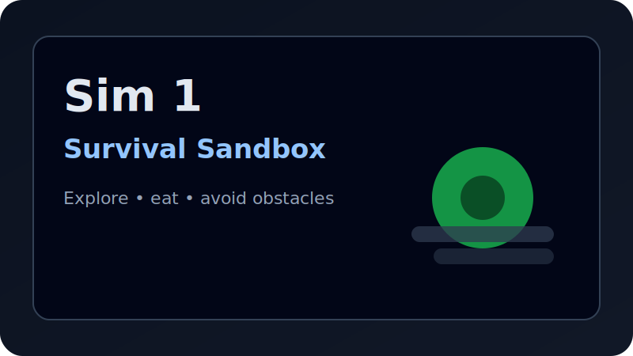
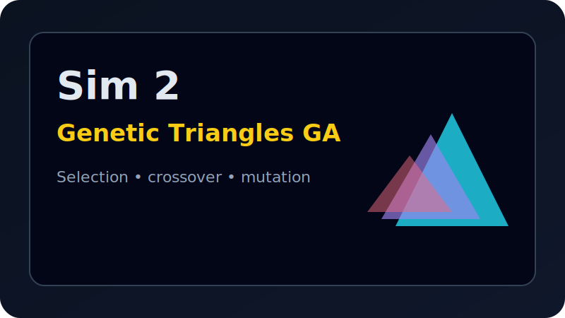
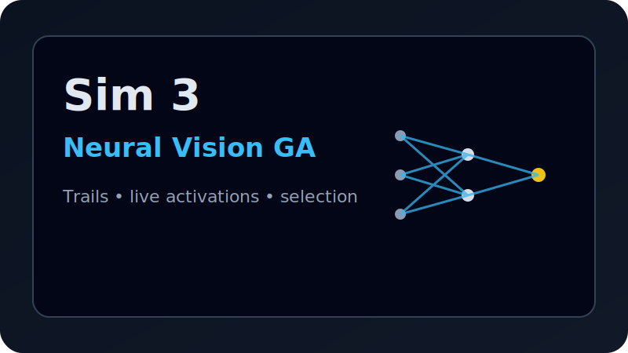
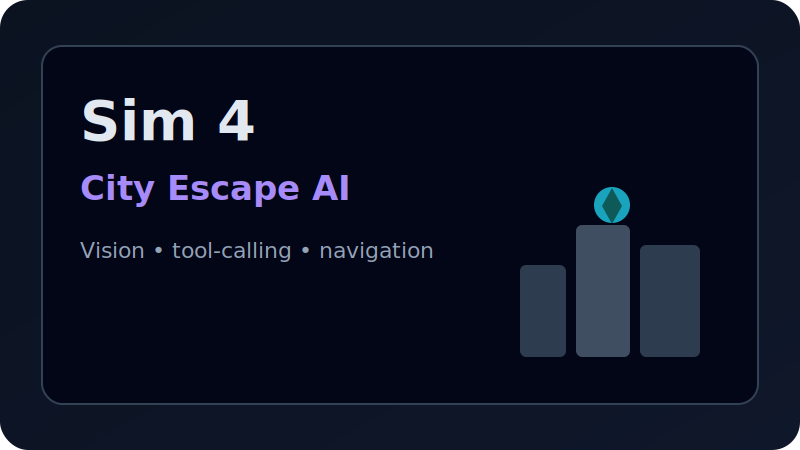

# survival-sim

A React + Vite simulation hub with BabylonJS-based simulations.

Live demo: https://survival-sim.vercel.app/

	

## Run

- Install: `npm install`
- Dev: `npm run dev`
- Build: `npm run build`

## Simulations

- Sim 1 (Survival Sandbox): [docs/sim1-survival-sandbox.md](docs/sim1-survival-sandbox.md)
- Sim 2 (Genetic Triangles GA): [docs/sim2-genetic-triangles.md](docs/sim2-genetic-triangles.md)
- Sim 3 (Neural Vision GA): [docs/sim3-neural-vision-ga.md](docs/sim3-neural-vision-ga.md)
- Sim 4 (City Escape AI): [docs/sim4-survival.md](docs/sim4-survival.md)

## Thumbnails

<table>
	<tr>
		<td align="center">
			<a href="docs/sim1-survival-sandbox.md">
				
				 
				<strong>Sim 1</strong>
			</a>
		</td>
		<td align="center">
			<a href="docs/sim2-genetic-triangles.md">
				
				 
				<strong>Sim 2</strong>
			</a>
		</td>
	</tr>
	<tr>
		<td align="center">
			<a href="docs/sim3-neural-vision-ga.md">
				
				 
				<strong>Sim 3</strong>
			</a>
		</td>
		<td align="center">
			<a href="docs/sim4-survival.md">
				
				 
				<strong>Sim 4</strong>
			</a>
		</td>
	</tr>
</table>
